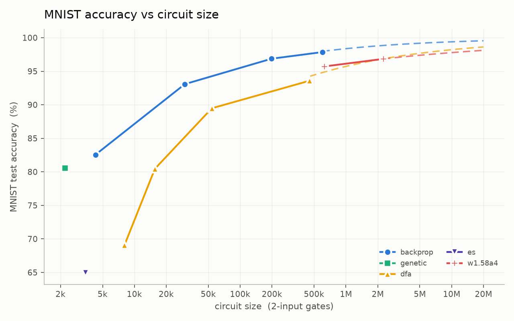
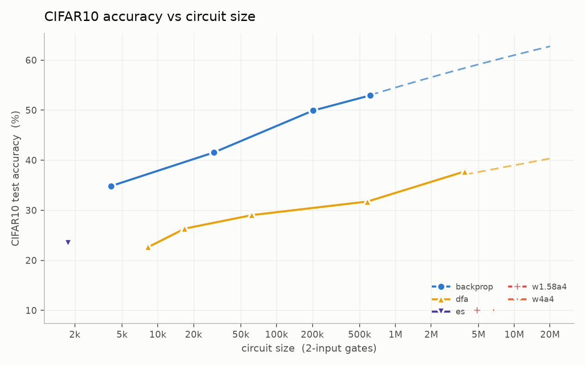

# Scaling logic by the gates it costs

How do **very different optimizers and model families** scale in **on-chip area** for image
classification? We train each model, emit it as a circuit, let `yosys`+`ABC` map it to 2-input gates,
and read accuracy off the gate netlist — so every method, from a learned logic net to a boosted tree
to a quantized MLP, lands on one axis: **circuit size (2-input gate count) vs. accuracy**, for **MNIST**
and **CIFAR10**.

Everything the model does at run time is in the circuit and is counted: the input encoding, the logic,
the readout, the argmax. That is what puts a logic net, a decision-tree ensemble and a quantized MLP
on the same axis.




## The methods

Five gradient / gradient-free logic-net optimizers, plus three quantized-MLP references, each swept
over **≥3 sizes** spanning ~200 → ~5M measured gates. Every point trains to convergence with **early stopping
on validation loss**.

| method | what it searches |
|---|---|
| `backprop` | learns each 2-input gate's truth table **and** its wiring by gradient descent (STE) |
| `genetic`  | every gate a NAND; evolves only the **wiring**, no gradients |
| `dfa`      | fixed butterfly wiring; learns the truth tables by **direct feedback alignment** |
| `es`       | fixed wiring; **continuous** per-LUT weights evolved by **evolution strategies** (hardened at emit) |
| `forest`   | SAMME-boosted **decision trees** over thermometer bits, shipped as gates |
| `w1.58a4` / `w1.58a8` / `w4a4` | quantized-MLP **references**: ternary or 4-bit weights, 4/8-bit activations, mapped to exact integer arithmetic |

`backprop`↔`genetic` is the tightest controlled pair (same encoder/head, gradient vs. gradient-free);
`es`↔`genetic` contrasts continuous vs. discrete gradient-free search.

## Reproduce

```bash
uv sync                                # .venv == uv.lock: Python 3.11, torch 2.6.0+cu124, numpy 2.4.6
uv run run.py all --device cuda        # every method x dataset (resumable; skips finished points)
uv run run.py plots                    # the four figures + results/leaderboard.md
```

`uv sync` installs the exact environment every published number came from — `uv.lock` is that
environment, and `uv run` re-checks it before each command. Without uv, `pip install -e .` gets a
loose, portable resolve (CPU or a newer CUDA) that trains numerically different nets; see
[docs/REPRODUCE.md](docs/REPRODUCE.md) for the pip route to the pinned one.

Measuring circuits needs `yosys`+`ABC` (and, only for the optional sky130 GE metric, the sky130
liberty). See [docs/REPRODUCE.md](docs/REPRODUCE.md). The measurement protocol is
[docs/RULES.md](docs/RULES.md).

## Layout

```
data.py       datasets (MNIST, CIFAR10) + DatasetSpec + bit packing
hw.py         SystemVerilog emitters: fan-in-2 LUT nets and quantized MLPs
harness.py    yosys+ABC synth, NAND-netlist simulation, measure/run, results IO
plots.py      the four figures + leaderboard
run.py        CLI + experiment matrix
methods/      backprop, genetic, dfa, es, forest, w1_58a4/w1_58a8/w4a4, and lut.py (shared scaffold)
results/<dataset>/<method>/<point>.s<seed>.{sv,ckpt,json}   circuit, checkpoint, metrics
                                                          (only the .json is committed)
```

Each `*.json` records accuracy, loss, perplexity, the NAND+INV 2-input gate count, and (when a liberty
is configured) sky130 gate equivalents.
